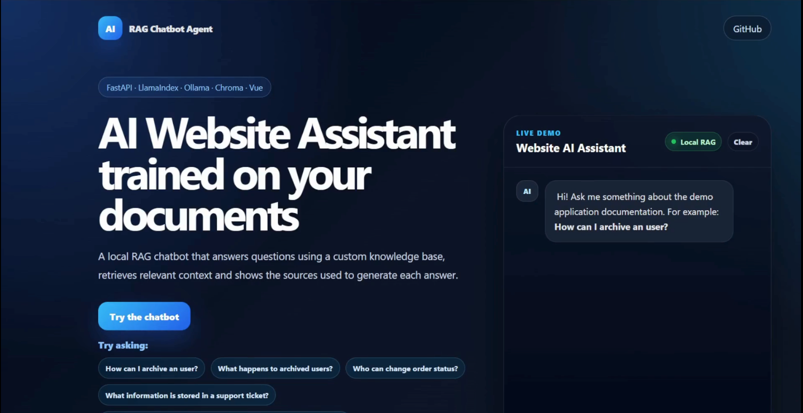

# RAG Chatbot Agent



## AI Website Assistant with RAG, Local LLM and Source Citations

**RAG Chatbot Agent** is a full-stack AI chatbot demo that answers questions using a custom knowledge base.

It uses a Retrieval-Augmented Generation architecture to retrieve relevant document chunks, generate contextual answers and show the source documents used for each response.

This project is designed as a practical AI assistant for websites, internal documentation, FAQs, customer support and business knowledge bases.

---

## Demo Video

A demo video is available in the portfolio version of the project.

If you are using this repository locally, you can place the demo video in:

```txt
frontend/public/RagChatbotPorfolio.mp4
```

---

## Main Features

- Document ingestion from local files
- RAG-based question answering
- Local LLM execution with Ollama
- Vector search with Chroma
- FastAPI backend
- Vue frontend chat interface
- Source citations for generated answers
- Markdown, TXT, PDF and DOCX support
- Reset endpoint for re-ingesting documents
- Docker Compose ready
- Built for portfolio, freelance demos and business use cases

---

## Tech Stack

### Backend

- **Python**
- **FastAPI**
- **LlamaIndex**
- **Ollama**
- **ChromaDB**
- **Hugging Face sentence-transformers**
- **Uvicorn**

### Frontend

- **Vue**
- **Vite**
- **CSS**

### Infrastructure

- **Docker**
- **Docker Compose**
- **Local vector storage**
- **Local LLM runtime**

---

## Project Architecture

```txt
rag-chatbot-agent/
│
├── backend/
│   ├── app/
│   │   ├── main.py
│   │   ├── config.py
│   │   ├── schemas.py
│   │   │
│   │   ├── routes/
│   │   │   ├── chat.py
│   │   │   └── ingest.py
│   │   │
│   │   └── services/
│   │       ├── ingest_service.py
│   │       └── rag_service.py
│   │
│   ├── data/
│   │   └── manual_demo.md
│   │
│   ├── storage/
│   ├── requirements.txt
│   └── Dockerfile
│
├── frontend/
│   ├── src/
│   │   ├── App.vue
│   │   ├── main.js
│   │   └── style.css
│   │
│   ├── public/
│   └── package.json
│
├── docker-compose.yml
├── .env.example
├── .gitignore
└── README.md
```

---

## How It Works

The project follows a simple RAG pipeline:

```txt
Documents
   ↓
Ingestion with LlamaIndex
   ↓
Embeddings generation
   ↓
Vector storage in Chroma
   ↓
User question
   ↓
Relevant chunks retrieved
   ↓
Ollama local LLM generates answer
   ↓
Answer returned with source citations
```

---

## Example Use Case

A business can add internal documentation, FAQs or service information to the `/backend/data` folder.

The assistant can then answer questions such as:

```txt
How do I archive a user?
Who can change order status?
What information is stored in a support ticket?
What happens if the chatbot does not have enough information?
```

Each answer includes the sources used to generate the response.

---

## Requirements

Before running the project, make sure you have installed:

- Python 3.10+
- Node.js 18+
- npm
- Ollama
- Git

Optional:

- Docker
- Docker Compose

---

## Local Installation

### 1. Clone the repository

```bash
git clone https://github.com/AlvaroMillanEstevez/rag-chatbot-agent.git
cd rag-chatbot-agent
```

---

### 2. Create a Python virtual environment

```bash
python3 -m venv .venv
source .venv/bin/activate
```

---

### 3. Install backend dependencies

```bash
python -m pip install --upgrade pip wheel
python -m pip install "setuptools<82"
python -m pip install -r backend/requirements.txt
```

---

### 4. Configure environment variables

Create a `.env` file in the root folder:

```env
LLM_PROVIDER=ollama

OLLAMA_BASE_URL=http://localhost:11434
OLLAMA_MODEL=qwen2.5:3b

EMBEDDING_MODEL=sentence-transformers/paraphrase-multilingual-MiniLM-L12-v2

DATA_DIR=backend/data
STORAGE_DIR=backend/storage
CHROMA_COLLECTION=rag_documents
SIMILARITY_TOP_K=4
SOURCE_SCORE_THRESHOLD=0.35
```

You can use `llama3.1:8b` if your machine has enough memory:

```env
OLLAMA_MODEL=llama3.1:8b
```

For lower-memory environments, `qwen2.5:3b` is recommended.

---

## Ollama Setup

Install Ollama from the official website:

```txt
https://ollama.com
```

Then pull the model:

```bash
ollama pull qwen2.5:3b
```

Test the model:

```bash
ollama run qwen2.5:3b
```

---

## Running the Backend

From the project root:

```bash
source .venv/bin/activate
export PYTHONPATH=backend
python -m uvicorn app.main:app --reload --port 8000
```

The API will be available at:

```txt
http://localhost:8000
```

Swagger documentation:

```txt
http://localhost:8000/docs
```

---

## Running the Frontend

Open a second terminal:

```bash
cd frontend
npm install
npm run dev
```

The Vue app will usually run at:

```txt
http://localhost:5173
```

---

## API Endpoints

### Health Check

```http
GET /
```

Response:

```json
{
  "status": "ok",
  "message": "RAG Chatbot Agent API is running"
}
```

---

### Service Health

```http
GET /health
```

Response:

```json
{
  "status": "healthy",
  "service": "rag-chatbot-agent"
}
```

---

### Project Info

```http
GET /info
```

Returns project features, model configuration and technical details.

---

### Ingest Documents

```http
POST /ingest
```

Loads supported files from:

```txt
backend/data
```

Supported formats:

```txt
.md
.txt
.pdf
.docx
```

Example:

```bash
curl -X POST http://localhost:8000/ingest
```

Response:

```json
{
  "status": "success",
  "documents_loaded": 1,
  "message": "Documents ingested successfully."
}
```

---

### Reset Vector Store

```http
DELETE /ingest/reset
```

Deletes the local Chroma vector store.

Example:

```bash
curl -X DELETE http://localhost:8000/ingest/reset
```

---

### Re-ingest From Scratch

```http
POST /ingest?reset=true
```

Example:

```bash
curl -X POST "http://localhost:8000/ingest?reset=true"
```

---

### Chat

```http
POST /chat
```

Request:

```json
{
  "question": "How do I archive a user?"
}
```

Response:

```json
{
  "answer": "To archive a user, the administrator must open the user management panel, select the target user and click the archive option.",
  "sources": [
    {
      "file_name": "manual_demo.md",
      "page_label": null,
      "score": 0.49,
      "text": "Relevant document chunk used to generate the answer..."
    }
  ]
}
```

---

## Example cURL Commands

### Ingest documents

```bash
curl -X POST http://localhost:8000/ingest
```

### Ask a question

```bash
curl -X POST http://localhost:8000/chat \
  -H "Content-Type: application/json" \
  -d '{"question":"How do I archive a user?"}'
```

### Reset and ingest again

```bash
curl -X DELETE http://localhost:8000/ingest/reset
curl -X POST http://localhost:8000/ingest
```

---

## Document Sources

Add your documents to:

```txt
backend/data
```

Example:

```txt
backend/data/manual_demo.md
backend/data/company_faq.pdf
backend/data/support_policy.docx
```

After adding or editing documents, run:

```bash
curl -X POST "http://localhost:8000/ingest?reset=true"
```

---

## Frontend Features

The Vue interface includes:

- Landing section
- Chat interface
- User and assistant messages
- Loading state
- Error handling
- Example questions
- Source display
- Source score
- Clear chat button
- Responsive design

---

## Why Local RAG?

This project demonstrates a privacy-friendly architecture where documents and AI processing can run locally.

Potential benefits:

- No external AI API required for the demo
- Documents stay on the local machine
- Useful for internal company documentation
- Adaptable to private knowledge bases
- Good foundation for business AI assistants

---

## Potential Business Use Cases

This project can be adapted for:

- Customer support chatbots
- Internal documentation assistants
- SaaS help centers
- Ecommerce support
- Real estate FAQs
- Tourism business assistants
- HR and onboarding documentation
- Technical documentation search
- Non-profit internal knowledge bases

---

## Planned Improvements

- Authentication
- User roles and permissions
- Chat history
- MySQL integration
- Admin panel for uploading documents
- Document management UI
- Conversation logs
- Answer evaluation
- Multi-tenant support
- Deployment guide
- Dockerized full-stack production setup
- Better out-of-context question detection
- Hybrid search
- Streaming responses

---

## Current Status

The project currently includes:

- Working FastAPI backend
- Working RAG pipeline
- Local Ollama model integration
- Chroma vector storage
- Vue frontend demo
- Source citations
- Local document ingestion

---

## Portfolio Description

**RAG Chatbot Agent** is a local AI website assistant built with FastAPI, LlamaIndex, Ollama, Chroma and Vue.

It can ingest documents, answer questions using a custom knowledge base and show the sources used for each response.

This project demonstrates practical AI integration, full-stack development, local LLM usage, vector search and source-grounded chatbot responses.

---

## Author

**Álvaro Millán Estevez**

Full-Stack Web Developer focused on Laravel, Vue, React, APIs, dashboards and AI-powered business tools.

- GitHub: [AlvaroMillanEstevez](https://github.com/AlvaroMillanEstevez)
- Portfolio: [alvaromillanestevez.github.io](https://alvaromillanestevez.github.io)
- LinkedIn: [Álvaro Millán Estevez](https://www.linkedin.com/in/alvaro-millan-estevez-27b814375)

---

## License

This project is available for portfolio and educational purposes.

You can adapt the architecture for your own projects, demos or business AI assistants.
